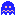

# PacMan-Game-Using-Java-Swing-AWT-

[](https://github.com/Seshasai-235/PacMan-Game-Using-Java-Swing-AWT-) [](https://github.com/Seshasai-235)

> A simple Java Swing & AWT implementation of the classic Pac-Man game.

---

## 📜 Overview

This repository contains a lightweight version of **Pac-Man**, built using **Java Swing** and **AWT**. It includes two primary classes:

* **App.java**: Sets up the main game window (board dimensions, tile size, frame properties).
* **PacMan.java**: Implements game logic, rendering loop, input handling, and movement for Pac-Man and ghosts.

The project demonstrates:

* Event-driven programming with `KeyListener`.
* Custom painting via `JPanel` and the `paintComponent()` method.
* Basic game loop mechanics and collision detection.

---

## 🚀 Features

* **Grid-based board**: Configurable rows, columns, and tile size.
* **Pac-Man movement**: Smooth directional movement (↑ ↓ ← →).
* **Ghost AI**: Blue (Inky), Red (Blinky), Pink (Pinky), Orange (Clyde), plus frightened state.
* **Collectibles**:

  * Standard pellets (`dot.png`)
  * Energizer pellets (`powerFood.png`)
  * Bonus fruit (`cherry.png`)
* **Maze walls**: Defined by `wall.png` tiles.
* **Sprite animation**: Direction-based Pac-Man and ghost sprites.
* **Collision detection**: Prevents movement through walls.

---

## 📦 Project Structure

```bash
PacMan-Game-Using-Java-Swing-AWT-/
├── assets/             # Sprite and asset images
│   ├── pacmanUp.png    # Pac-Man facing up
│   ├── pacmanDown.png  # Pac-Man facing down
│   ├── pacmanLeft.png  # Pac-Man facing left
│   ├── pacmanRight.png # Pac-Man facing right
│   ├── blueGhost.png   # Inky
│   ├── redGhost.png    # Blinky
│   ├── pinkGhost.png   # Pinky
│   ├── orangeGhost.png # Clyde
│   ├── scaredGhost.png # Frightened ghost
│   ├── wall.png        # Maze wall tile
│   ├── powerFood.png   # Energizer pellet
│   └── cherry.png      # Bonus fruit
├── App.java            # Main application entry point
├── PacMan.java         # Game panel: logic, rendering, input
├── .gitignore          # Git ignore rules
└── README.md           # Project documentation
```

> **Note:** Ensure all asset files are committed under `assets/` and loaded via:
>
> ```java
> getClass().getResource("/assets/<filename>");
> ```

---


## 🖼️ Sprite Previews

### Ghosts

<p float="left">
  
  
  
  
  
</p>

### Pac-Man Sprites

<p float="left">
  
  
  
  
</p>

---

### Collectibles & Environment

<p float="left">
  
  
  
  
</p>

---

## ⚙️ Prerequisites

* **Java Development Kit (JDK) 8** or higher
* A Java IDE (VS Code, IntelliJ IDEA, Eclipse, NetBeans) or command-line tools

---

## 💻 Installation & Setup

Follow these steps to set up and run the project locally:

```bash
# Clone your repository
git clone https://github.com/Seshasai-235/PacMan-Game-Using-Java-Swing-AWT-.git

# Navigate into the project directory
cd PacMan-Game-Using-Java-Swing-AWT-

# Compile the Java source files
javac -d bin App.java PacMan.java

# Run the game
java -cp bin App
```

## 🎮 How to Play

* **Controls**: Use the arrow keys to move Pac-Man.
* **Objective**: Collect all pellets, avoid ghosts, and use energizers to turn the tables on frightened ghosts.

---

## 🛠️ Customization & Extensions

* **Maze Layout**: Define your own maze via a 2D array or external file (JSON/text) using `wall.png` tiles.
* **Ghost Behavior**: Enhance AI with pathfinding (BFS, DFS, A\*).
* **UI Overlays**: Add score, level, and lives display using Swing components.
* **Sound Effects**: Integrate audio (`.wav` files) for pellet collection and ghost chases.

---


## 📬 Contact

Created by **[Seshasai-235](https://github.com/Seshasai-235)**.

Happy coding and enjoy the chase! 🎉
